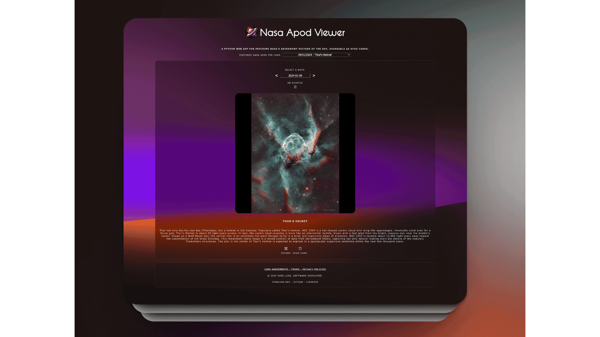

# Welcome to the [Nasa Apod Viewer](https://apod-nasa-viewer.vercel.app/) Project.

This project is a Python web application built with Flask. It fetches NASA's Astronomy Picture of the Day (APOD) from the NASA API and provides functionalities to view and share the images as APOD cards.

## Demo

Visit the live app: [apod-nasa-viewer.vercel.app](https://apod-nasa-viewer.vercel.app)

## Preview




## Key Features

- Fetches the Astronomy Picture of the Day from the NASA API.
- Enables users to explore APOD images via a calendar navigation or by searching for specific dates.
- Includes a 'Shuffle' option that randomize picks for users who are uncertain which date to explore.
- Showcases a curated selection of the finest APOD images from 1995 (the inception year of APOD) to the present via the 'Featured NASA APOD per year' Recommendations section.
- Generates shareable APOD cards comprising the retrieved image, title, and description.
- **YouTube Integration (New Feature):** Users can now watch APOD videos directly within the application interface. They can also share these YouTube videos as APOD cards, expanding the application's sharing functionality. With this enhancement, users can easily spread the word about their favorite astronomical discoveries.

## To-Do:
- **Address NASA delays or APOD update failures by implementing fetching from the API on the previous day (DONE); resolve date-picker script issue within this context (PENDING).**


## Installation and Usage

To run this project locally, follow these steps:

1. Clone the repository to your local machine:

   ```bash
   git clone https://github.com/imprvhub/nasa-apod-viewer.git
   ```

2. Install the required dependencies:

    ```bash
   pip install -r requirements.txt
   ```

3. Set up environment variables. Ensure you have a .env file with the following variables:

     ```bash
    NASA_API_KEY: Your NASA API key.
    DATABASE_HOST: Hostname of your database.
    DATABASE_USERNAME: Username for database access.
    DATABASE_PASSWORD: Password for database access.
    DATABASE: Name of the database.
   ```

4. Run the Flask application:
    ```bash
   cd api
   python3 index.py
   ```
   Then it should be accessible at
    ```bash
   http://localhost:5000/
   ```

## Conclusion:

#### Achievements

- **Efficient Management of Complex Workflow and Scripts:** Efficient Management of Complex Workflow and Scripts: Effectively handling the intricate workflow involving multiple script executions to facilitate user interaction and offer various options, such as randomization, date selection, and APOD card generation, was the primary challenge addressed in this project. Ensuring the desired outcomes following each script execution and interaction was particularly rewarding. This required orchestrating a sequence of API calls to dynamically update the APOD based on user interactions, each serving distinct purposes. Attention to detail and comprehensive testing were essential to ensure seamless functionality throughout the process.

#### Learnings

- **Enhanced Frontend-Backend Interaction:** I gained insights into achieving improved interaction between frontend scripts and Python backend processes. Previously, my approach was limited to transmitting specific data and processing it. However, this project necessitated establishing a continuous exchange of data between the frontend and backend due to the numerous scripts and interactions within the web application. It was a valuable learning experience.   

## Feedback & Support
Your input matters, and I'm ready to help address any inquiries or feedback you may have. Your contributions are essential for refining the project and enhancing the overall user experience. Don't hesitate to get in touch with me:

Feel free to share your insights, recommendations, or suggestions for continuous improvement. If you encounter any challenges or require assistance, please [create a new GitHub issue](https://github.com/imprvhub/nasa-apod-viewer/issues/new). Be sure to provide a detailed description of your issue to facilitate prompt and precise support.

## License

This project is licensed under the MIT License. See the [LICENSE](https://github.com/imprvhub/nasa-apod-viewer/blob/main/LICENSE.md) file for details.

